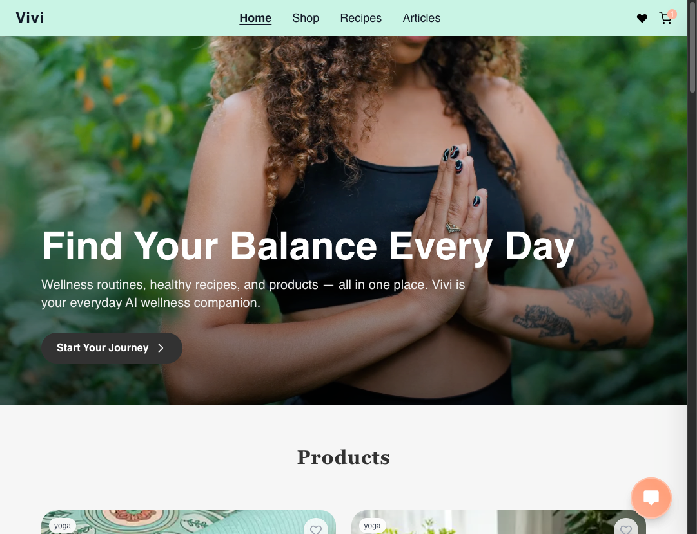

#Vivi Wellness — это wellness-платформа с продуктами, рецептами и чат-ботом 


## 🌐 Live Demo

💻  [vivi-wellness.vercel.app](https://vivi-wellness.vercel.app/)



---

## 🛠 Tech Stack

Framework & Core

Next.js 15 (App Router)
 — modern React framework for SSR/SSG

React 18
 — UI library

Tailwind CSS 3
 — utility-first styling

PostCSS
 — CSS post-processing

State & Data

Zustand
 — lightweight state management

TanStack React Query
 — asynchronous data fetching & caching

CMS & Commerce

Sanity Client
 — headless CMS for structured content

PortableText React
 — rendering Sanity Portable Text

React Markdown
 — markdown content support

AI & Integrations

OpenAI Edge
 — serverless AI queries on edge functions

AI SDK
 — chatbot & generative AI features

Tooling

TypeScript 5
 — static typing

ESLint 9
 + eslint-config-next
 — linting & code style


## 🎯 Features

-💬 Interactive ChatBot — with predefined buttons and quick replies

🛒 Client-side Store & Cart — shopping cart and checkout flow handled fully on the client

📦 Product Catalog — product list with filtering and search

🔍 Search & Filtering — unified search across products, articles, and recipes

🔗 Linked Content — products are connected with related articles and recipes for context and recommendations

📝 CMS via Sanity — content management for products, articles, and recipes through headless CMS

📱 Responsive UI — optimized for both mobile and desktop

---


## 🚀 Deployment

Deployed via [Vercel](https://vercel.com/)

```bash
# Local development
npm install
npm run dev
```
Open (http://localhost:3000) in your browser to see the result.

## 📬 Контакты

**Galyna Krupska**  
Frontend / UI Developer  

📧 galynakrupska9@gmail.com  
🌐 [LinkedIn](hhttps://www.linkedin.com/in/galyna-krupska-398a3729/)  
🐙 [GitHub](https://github.com/galynakrupska)
